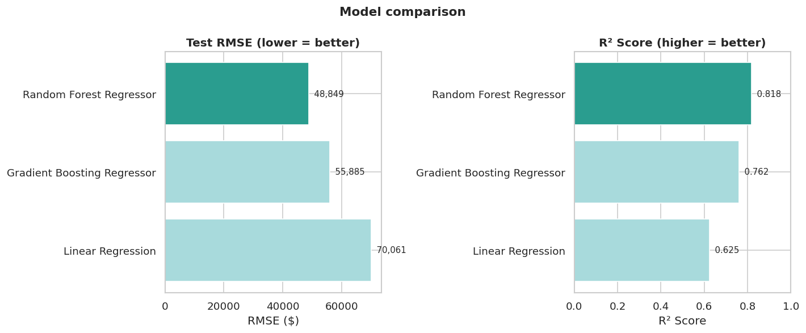

# House Price Predictor 🏠

A beginner-friendly machine learning project that predicts median house prices for
California neighborhoods, using real 1990 census data from Kaggle.

## What this project does
1. Loads the data
2. Explores it (EDA)
3. Cleans it (fills missing values, converts text to numbers)
4. Trains three different models
5. Compares them and picks a winner

No prior machine learning experience is needed to follow along — the notebook
explains each step in plain language as it goes.

## Tech Stack
- Python
- Pandas
- NumPy
- Scikit-learn
- Matplotlib
- Jupyter Notebook

## Model Comparison

| Model | Cross Validation RMSE | Test RMSE | R² Score |
|--------|-----------------------|-----------|----------|
| Random Forest Regressor | 49,224.61 | 48,848.88 | 0.8179 |
| Gradient Boosting Regressor | 54,957.85 | 55,884.66 | 0.7617 |
| Linear Regression | 68,622.54 | 70,060.52 | 0.6254 |

**Best Performing Model: Random Forest Regressor** (lowest error, highest R²).

*(Quick glossary: RMSE = how far off predictions are, on average, in dollars — lower
is better. R² = how much of the price variation the model explains, from 0 to 1 —
higher is better.)*

## Results
- Lowest RMSE achieved: **$48,848.88** (Random Forest Regressor, on data it never saw during training)
- Best model: **Random Forest Regressor**
- Model comparison chart: `model_comparison.png`
- Feature importance plot: `feature_importance.png`
- Residual plot: `residuals_plot.png`



## Dataset
`data/housing.csv` is the full Kaggle "California Housing Prices" dataset — 20,640
neighborhoods, 10 columns — included right in the repo, so nothing needs to be
downloaded separately.

## Setup Steps

1. Clone the repository.
2. Install the required libraries:
   ```
   pip install -r requirements.txt
   ```
3. Open `house_price_predictor.ipynb` in Jupyter.
4. Run every cell in order: `Kernel → Restart & Run All`.

## Reflection
The biggest lesson from this project was that model choice matters less than *how*
a model handles bendy, non-straight-line relationships — both tree-based models
(Random Forest and Gradient Boosting) beat plain Linear Regression by a wide margin,
because house prices simply don't move in a straight line with income or location.
Cross-validation was reassuring, too: it confirmed the winning model's score wasn't
just a lucky split of the data. Working through the cleaning step also made it clear
that "real" data always needs a couple of small, deliberate fixes — in this case,
filling in a handful of missing values and turning one text column into numbers a
model could actually use.
